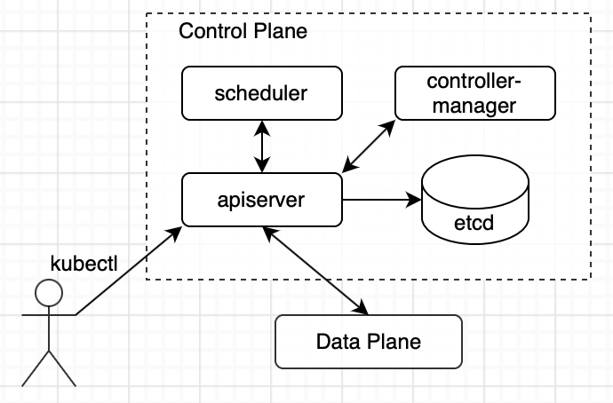
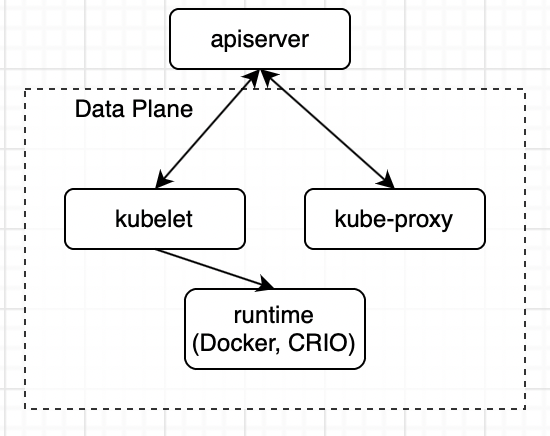

# HELM

Используя Helm, мы можем создать Шаблон нашего Деплоймента, и деплоить наши приложения используя двухстрочные файлы values.yaml

    namespace: load
    secretName: load-secret

Предварительно создать charts

    helm create chart

Используя конструкцию {{ }} мы добавили переменные, если конструкция {{ .Values... }}, то значение переменной подставится из файла values.yaml, но есть и Хельмовые переменные в стиле {{ .Release.Name }}.

    helm install helm-release  chart -n namespace -f chart/values.yaml --create-namespace                                                 master*
    NAME: helm-release
    LAST DEPLOYED: Sun Jun 25 13:44:08 2023
    NAMESPACE: namespace
    STATUS: deployed
    REVISION: 1
    TEST SUITE: None

    kubectl get pods -o wide -n namespace
    NAME                                       READY   STATUS    RESTARTS   AGE   IP      NODE             NOMINATED NODE   READINESS GATES
    helm-release-deployment-855867b579-5gxst   1/1     Running   0          32s   **    kuber-worker-1   <none>           <none>
    helm-release-deployment-855867b579-rch6g   1/1     Running   0          32s   **    kuber-worker-2   <none>           <none>
    helm-release-deployment-855867b579-t5w2g   1/1     Running   0          32s   **    kuber-master     <none>           <none>

helm Install - запуск установки, helm-release - имя релиза ( {{ .Release.Name }} ), chart - папка с самим Чартом, -f test-chart/values.yaml - мы могли не писать, так как эти значения используются в чарте по дефолту.

Удалить релиз

    helm uninstall my-helm-release

Сборка архива с chart

    helm package chart 

### Установка Grafana

подключаем репозиторий 

    helm repo add grafana https://grafana.github.io/helm-charts
    helm repo update 

    helm install grafana grafana/grafana

Ждём пока Под не будет запущен 

    kubectl get pods -w 

Вытаскиваем пароль для доступа к админской учётной записи

    kubectl get secret --namespace default grafana -o jsonpath="{.data.admin-password}" | base64 --decode ; echo 

Совершаем проброс на ружу

    export POD_NAME=$(kubectl get pods --namespace default -l "app.kubernetes.io/name=grafana,app.kubernetes.io/instance=grafana" -o jsonpath="{.items[0].metadata.name}")
    kubectl --namespace default port-forward $POD_NAME 3000

Доступ по ssh тунелю

    ssh -L 127.0.0.1:3000:192.168.88.50:3000 inspector@192.168.88.50

### kube-prometheus-stack

    helm repo add prometheus-community https://prometheus-community.github.io/helm-charts
    helm repo update

    helm install prometheus prometheus-community/kube-prometheus-stack

Установиться сразу набор Prometheuse Nose Exporter

https://computingforgeeks.com/setup-prometheus-and-grafana-on-kubernetes/

Найти имя пода 

    kubectl -n default get svc
    NAME                                      TYPE        CLUSTER-IP       EXTERNAL-IP   PORT(S)                      AGE
    alertmanager-operated                     ClusterIP   None             <none>        9093/TCP,9094/TCP,9094/UDP   9m51s
    grafana                                   ClusterIP   10.96.21.245     <none>        80/TCP                       27m
    kubernetes                                ClusterIP   10.96.0.1        <none>        443/TCP                      104d
    myservice                                 ClusterIP   10.103.245.225   <none>        80/TCP                       104d
    prometheus-operated                       ClusterIP   None             <none>        9090/TCP                     9m48s
    prometheuse-grafana                       ClusterIP   10.109.125.74    <none>        80/TCP                       11m
    prometheuse-kube-prometheu-alertmanager   ClusterIP   10.98.28.110     <none>        9093/TCP                     11m
    prometheuse-kube-prometheu-operator       ClusterIP   10.107.236.61    <none>        443/TCP                      11m
    prometheuse-kube-prometheu-prometheus     ClusterIP   10.107.150.137   <none>        9090/TCP                     11m
    prometheuse-kube-state-metrics            ClusterIP   10.100.250.218   <none>        8080/TCP                     11m
    prometheuse-prometheus-node-exporter      ClusterIP   10.105.46.222    <none>        9100/TCP                     11m

https://grafana.com/grafana/dashboards/12062-node-exporter/
https://helm.sh/docs/intro/quickstart/

PINGER https://github.com/MadEngineX/k8s-pinger

### Control Plane

правляющий уровень Kubernetes состоит из 4-х объектов, которые расположены на Мастер-Нодах. Для отказоустойчивости кластера рекомендуем соблюдать кворум Мастеров например, 3 Мастер-Ноды.

Data Plane
Компонентами на Воркер-Нодах являются runtime, kubelet и kube-proxy.

поиск проблемы в поде если нет ответа в логах и describe

    sudo journalctl -u kubelet | grep <podname>