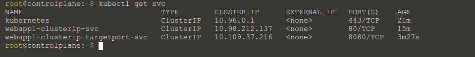
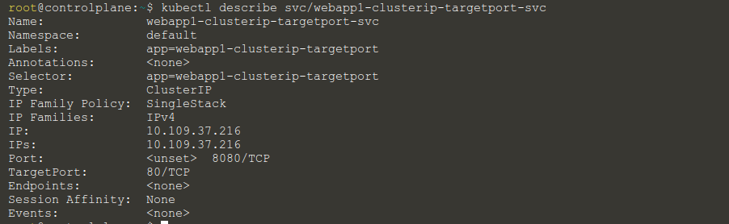
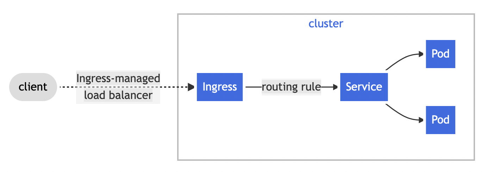

# Kubernetes Sandbox
https://learning.oreilly.com/

Health Check

    kubectl cluster-info

View all nodes

    kubectl get nodes

View all pods

    kubectl get pods --all-namespaces

View local containers

    crictl ps

    kubectl get svc

    kubectl describe svc/webapp1-clusterip-targetport-svc

Ответ **TargetPort:        80/TCP**

Узнать IP адрес 

    export CLUSTER_IP=$(kubectl get services/webapp1-clusterip-targetport-svc -o go-template='{{(index .spec.clusterIP)}}')
    echo CLUSTER_IP=$CLUSTER_IP

Ingress мы можем задать единую точку входа в наш кластер. Ingress позволяет нам назначить для каждого Сервиса свой URL, доступный вне кластера. В отличие от таких контроллеров, как Deployment, DaemonSet, Job и прочих, Ingress Controller не располагается внутри kube-conroller-manager, его надо устанавливать отдельно, например, используя публичный Хельм Чарт. https://docs.nginx.com/nginx-ingress-controller/installation/installation-with-helm/

Ingress Controller - задеплоенный в отдельном Неймспейсе ресурс, который как правило порождает Поды ingress-nginx, через них и осуществляется вся балансировка. А также есть ресурс Ingress, он располагается в том же Неймспейсе, где находится Под и Сервис

Пример манифеста для описания Ингресс ресурса:

    apiVersion: networking.k8s.io/v1
    kind: Ingress
    metadata:
    name: simple-fanout-example
    spec:
    rules:
    - host: foo.bar.com
        http:
        paths:
        - path: /foo
            pathType: Prefix
            backend:
            service:
                name: service1
                port:
                number: 4200
        - path: /bar
            pathType: Prefix
            backend:
            service:
                name: service2
                port:
                number: 8080

Ингресс предоставляет нам гораздо больше вариативности, например мы можем иметь wildcard домен *.production.myCompany, и создавать Ингрессы с URL вида https://grafana.production.myCompany/ (для доступа к Сервису Графаны), https://kibana.production.myCompany/ (для доступа к Сервису Кибаны).